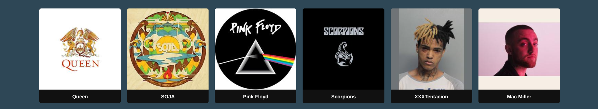

<p align="center">
  
</p>

---

## 📖 Table of contents

1. [**📚 About the project**](#-about-the-project)
2. [**🚀 How to run the project**](#-how-to-run-the-project)
3. [**💻 Technologies**](#-technologies)
4. [**📁 Project Structure**](#-project-structure)
5. [**🎬 Presentation**](#-presentation)
6. [**👥 Credits**](#-credits)

---

## 📚 About the project

This project was developed during the Groupie-Tracker project. The goal was to create a web application to track music artists and their details using Go templates.

- 🎤 Artist details and images
- 📅 Concert locations
- 🔍 Search functionality

The final project repository can be found [here](https://github.com/xLuuxx/Groupie-Tracker.git)

---

## 🚀 How to run the project

To run the project, you will need to have Go installed on your computer. If you don't have it, you can download it [here](https://golang.org/dl/).

1. Clone the repository:
```bash
git clone https://github.com/xLuuxx/Groupie-Tracker.git
cd Groupie-Tracker
go run .
```

2. Open your browser and go to `http://localhost:8080/` to use the application.

---

## 💻 Technologies

The project was developed using the following technologies:
- [Go](https://golang.org/)
- [GoHTML](https://pkg.go.dev/html/template)
- [Json](https://pkg.go.dev/encoding/json)

---

## 📁 Project Structure

```
.
├── cmd
│   └── main.go
├── data
│   └── SpotifyID.json
├── go.mod
├── internal
│   ├── API
│   │   └── API.go
│   ├── back
│   │   ├── artistPage.go
│   │   ├── routes.go
│   │   └── startServer.go
│   └── structure
│       └── structure.go
├── pkg
│   └── utils
│       └── utils.go
├── readmeFiles
├── README.md
└── web
    ├── static
    │   ├── css
    │   │   ├── artist.css
    │   │   ├── errorinput.css
    │   │   ├── homepage.css
    │   │   └── marker.svg
    │   ├── data
    │   │   ├── colors.json
    │   │   └── images
    │   │       └── img.png
    │   └── js
    │       └── artist.js
    └── template
        ├── artist.gohtml
        ├── errorinput.gohtml
        ├── homepage.gohtml
        └── index.gohtml
```

## 🎬 Credit
Made by. Oiha, Luu and Fayed. 
